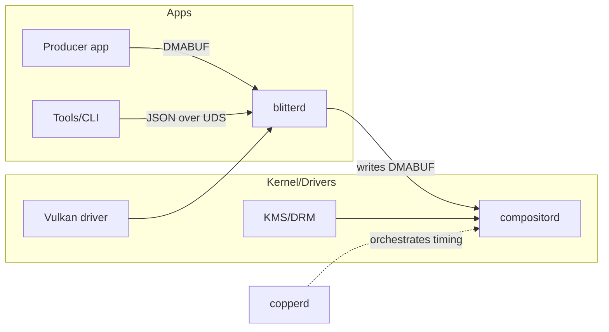

# blitterd

**CopperlineOS 2D blitter service.**  
`blitterd` performs fast 2D buffer operations—**rect fill**, **rect copy**, and **format convert**—on shared GPU buffers (DMABUFs). In Phase‑0 it uses Vulkan transfer/compute queues to move pixels with minimal CPU involvement. The service exposes a tiny JSON protocol over a Unix domain socket.

> TL;DR: move pixels fast and predictably, without dragging a full graphics stack into the hot path.

---

## Why it exists

The compositor (`compositord`) wants clean, ready‑to‑draw surfaces. Apps shouldn’t have to carry bespoke GPU code just to clear/copy/convert textures. `blitterd` centralises those operations so they’re **consistent, low‑latency, and zero‑copy** across the system.

- **Zero‑copy** pipelines via DMABUF import/export.  
- **Deterministic** execution with optional fences and completion events.  
- **Simple** JSON API (binary ring in later phases).  
- **Future‑proof** path to FPGA offload for “Blitter‑2.0”.

---

## Status

- Phase‑0 JSON protocol: **stable‑ish (v0)**  
- Backends: Vulkan transfer/compute on Linux  
- Language: Rust  
- License: MIT OR Apache‑2.0

---

## Architecture (Phase‑0)



- Apps or `compositord` hand `blitterd` **DMABUF FDs** (or, in debug mode, file paths).  
- `blitterd` runs the operation (fill/copy/convert) on the GPU’s transfer/compute queue.  
- Results are visible to `compositord` on the next latch/commit.

---

## Concepts

- **Surface**: a DMABUF (preferred) or debug file-backed buffer with `w`, `h`, `format`, `stride`, `modifier`.  
- **Job**: a one‑shot operation that may batch multiple ops and signal a fence/event on completion.  
- **Region**: `{x, y, w, h}` rectangle in pixels; coordinates are top‑left origin.  
- **Format**: e.g., `RGBA8`, `BGRA8` (Phase‑0); YUV/NV12 in later revisions.

---

## Protocol (Phase‑0 JSON, v0)

**Socket (default):** `/run/copperline/blitterd.sock`  
Configurable via `BLITTERD_SOCKET`.

### Client → `blitterd`

- `{"cmd":"ping"}` → `{"ok":true,"name":"blitterd","version":"0.1.0"}`
- `{"cmd":"rect_fill","dst":<surface>,"rect":{"x":0,"y":0,"w":128,"h":128},"color":{"r":255,"g":0,"b":255,"a":255}}`
- `{"cmd":"rect_copy","src":<surface>,"dst":<surface>,"src_rect":{"x":0,"y":0,"w":128,"h":128},"dst_xy":{"x":200,"y":100}}`
- `{"cmd":"convert","src":<surface>,"dst":<surface>}` *(format/stride may differ; sizes must match)*
- `{"cmd":"batch","ops":[ ... ]}` *(run multiple ops as one job)*
- `{"cmd":"subscribe","events":["complete","error"]}`

**Surface objects** (DMABUF recommended):

```json
{
  "fd": 17,
  "w": 1920,
  "h": 1080,
  "format": "RGBA8",
  "stride": 7680,
  "modifier": "LINEAR"
}
```

**Debug file surfaces** (for quick demos; slower, copies via staging):

```json
{
  "path": "/tmp/sprite.rgba",
  "w": 128,
  "h": 128,
  "format": "RGBA8",
  "stride": 512
}
```

### Events (server → client)

- `{"event":"complete","job":123,"usec":4213}`  
- `{"event":"error","job":123,"message":"description"}`

**Notes**
- Rects are **clipped** to destination bounds.  
- Overlapping `src`/`dst` with `rect_copy` is implementation‑defined in v0 (avoid or use `blit` when available).  
- Color components are 0–255 in v0; HDR/linear color is planned for later.

---

## Quick start

### Option A: Debug file‑backed buffer (fastest to see something)

```bash
# 1) Start compositord (in another terminal) and create a layer bound to /tmp/sprite.rgba
portctl /run/copperline/compositord.sock '{"cmd":"create_layer"}'
portctl /run/copperline/compositord.sock   '{"cmd":"bind_image","id":1,"path":"/tmp/sprite.rgba","w":256,"h":256,"format":"RGBA8"}'
portctl /run/copperline/compositord.sock   '{"cmd":"set","id":1,"x":100,"y":100,"alpha":1.0,"z":5,"visible":true}'

# 2) Fill a magenta square into the file via blitterd
portctl /run/copperline/blitterd.sock   '{"cmd":"rect_fill","dst":{"path":"/tmp/sprite.rgba","w":256,"h":256,"format":"RGBA8","stride":1024}, "rect":{"x":0,"y":0,"w":256,"h":256}, "color":{"r":255,"g":0,"b":255,"a":255}}'
```

You should see a 256×256 magenta square appear at (100,100).

### Option B: Proper zero‑copy DMABUFs

1) Allocate a DMABUF in your app (or request one from `compositord`—API to be finalised).  
2) Bind it to a layer in `compositord`.  
3) Send its FD as the `dst` surface to `blitterd` and issue `rect_fill` / `rect_copy`.  
4) The layer updates on the next vsync commit without staging copies.

---

## Building from source

```bash
# Prereqs: Rust stable, Vulkan loader/headers, libdrm for DMABUF helpers
git clone https://github.com/CopperlineOS/blitterd
cd blitterd
cargo build --release

RUST_LOG=info ./target/release/blitterd
```

Environment variables:

- `BLITTERD_SOCKET=/run/copperline/blitterd.sock`  
- `BLITTERD_DEVICE=auto|/dev/dri/renderD128`  
- `BLITTERD_DEBUG_FILES=0|1` *(enable file‑backed surfaces)*

---

## Development guide

- **Crates**: `blitterd-core` (ops & scheduler), `blitterd-ipc` (JSON protocol), `blitterd-backend` (Vulkan), `blitterd-bin` (daemon).  
- **Ops**: implemented as GPU pipelines (transfer for copy/fill; compute for format convert).  
- **Sync**: implicit within a job; explicit external fences planned (shared with `copperd` timelines).  
- **Validation**: surface dims/format/stride/modifier are checked; out‑of‑bounds rects are clipped.  
- **Performance**: batches coalesce ops to minimize barriers; device selection prefers a render node.

**Supported formats (v0)**: `RGBA8`, `BGRA8` (more via feature flags).  
**Planned**: `NV12`, `RGB10A2`, sRGB awareness, color‑managed convert.

---

## Roadmap

- **v0.1**: `rect_fill`, `rect_copy`, `convert` (RGBA/BGRA), debug file surfaces.  
- **v0.2**: `blit` (scale/nearest and linear), per‑op alpha modulate, tiled ops.  
- **v0.3**: YUV/NV12 ↔ RGBA convert, partial damage guidance to `compositord`.  
- **v0.4**: FPGA Blitter‑2.0 backend with DMA command ring.  
- **v0.5**: Security caps (FD quotas, rate limits), binary protocol.

RFCs will appear in [`CopperlineOS/rfcs`](https://github.com/CopperlineOS/rfcs).

---

## Contributing

We welcome issues and PRs!

1. Read `CONTRIBUTING.md`.  
2. Check **good first issue** / **help wanted** labels.  
3. Protocol/format additions → open an RFC and link it in your PR.

Code of Conduct: `CODE_OF_CONDUCT.md`.

---

## Security

`blitterd` handles FDs received from untrusted clients—**validate everything**.  
Prefer running as an unprivileged user with access to a render node (`/dev/dri/renderD*`), not as root.  
Report vulnerabilities to **security@copperline.os** (placeholder) or via GitHub advisories. See `SECURITY.md`.

---

## License

Dual‑licensed under **Apache‑2.0 OR MIT**.

---

## See also

- [`compositord`](https://github.com/CopperlineOS/compositord): Vulkan/KMS compositor + layer registers  
- [`copperd`](https://github.com/CopperlineOS/copperd): timeline engine (drives per‑frame changes)  
- [`ports`](https://github.com/CopperlineOS/ports): message‑port protocol & client libs  
- [`examples`](https://github.com/CopperlineOS/examples): DMABUF demos and integration tests
